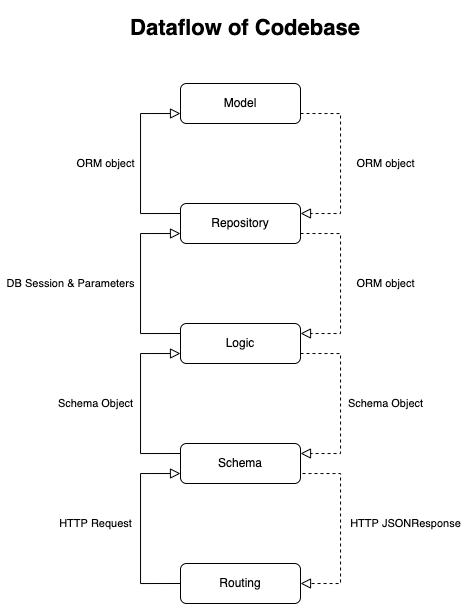
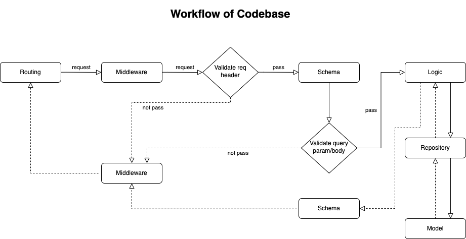

# FastAPI {{ cookiecutter.project_slug }}

FastAPI {{ cookiecutter.project_slug }} is a project for jumpstarting MVP-ready Python API projects quickly.

----

## Table of Contents

* **[Overview](#overview)**
* **Features**
  * Support for [Fastapi ^0.78.0](https://github.com/tiangolo/fastapi/releases/tag/0.78.0).
  * Tested with [Python 3.10.4](https://www.python.org/downloads/release/python-3104/), [PostgreSQL 13.5](https://www.postgresql.org/docs/13/release-13-5.html), [Redis 5.0](https://redis.io/download/#redis-50), [RabbitMQ 3.10](https://blog.rabbitmq.com/posts/2022/03/rabbitmq-3.10.0-release-calendar/).
  * Support class-base-view. Default, FastAPI only supports function-base-view.
  * Optimized development and production settings.
  * Docker support using docker-compose for development, production, testing. It also support deploy on AWS EC2, AWS ECS.
  * Integrations Object Relational Mapper with [SQLAlchemy](https://www.sqlalchemy.org/) and [psycopg2](https://www.psycopg.org/) driver.
  * Setup migration with [Alembic](https://alembic.sqlalchemy.org/en/latest/).
  * Run tests with [pytest](https://docs.pytest.org/en/7.1.x/).
  * Integrations cache response with Redis and [fastapi-cache2](https://github.com/long2ice/fastapi-cache)
  * Default is integrated with [OpenAPI](https://github.com/OAI/OpenAPI-Specification).
* **Development**
  * [Installation within docker](#docs/installation_within_docker.md).
  * [Installation without docker](#docs/installation_without_docker.md).
  * [Usage](docs/usage_development.md).
* **Deployment (Updating)**
  * [Deployment on AWS EC2](docs/deployment_on_ec2.md).
  * [Deployment on AWS ECS](docs/deployment_on_ecs.md).
  * [Deployment on other](docs/deployment_on_other.md).
* **Optional Integrations**
  * [Fabric](https://www.fabfile.org/), [Ansible](https://docs.ansible.com/ansible/latest/reference_appendices/python_3_support.html) for deploy to server on-promises.
  * Configuration for [Celery](https://docs.celeryq.dev/en/stable/getting-started/introduction.html) with Redis and RabbitMQ.
  * Integration with [Sentry](https://sentry.io/welcome/) for error logging.
  * Integration [ELK Stack Docker](https://www.elastic.co/what-is/elk-stack) .
* **[Alternatives, Inspiration and Comparisons](docs/alternatives_inspiration_comparisons.md)**
* [Contributing](#Contributing)
* [Version History](#version-history)
* [License](#license)

----

### Overview

Syntax `async/await` was introduced in `Python 3.5`. `asyncio` is a library to write concurrent code using this syntax.

FastAPI are known to integration asynchronous on the core of framework. FastAPI is [very high performance](https://fastapi.tiangolo.com/#performance).
It also supports typing strongly (`Pydantic` and `Python ^3.6` based on standard Python type hints).

Inspired by [Cookiecutter Django](https://github.com/cookiecutter/cookiecutter-django), I created this {{ cookiecutter.project_slug }}.

Here is Dataflow and Workflow of {{ cookiecutter.project_slug }}:





With a component, I separated MVC with 3 layers to MRLSR with 5 layers. It includes:

* Models(M):
  * Manage only the pure data.

* Repository(R):
  * Handle database logic.

* Logic(L):
  * Handle business logic.
  * Handle third party service.

* Schema(S):
  * Validate HTTP Request/JsonResponse.
  * Mapper data Request/JsonResponse

* Routing(R):
  * Define routing
  * Define ApiResponse object with input/output.

With multiple components...

For medium-sized apps and above, `monoliths` are really-bad.

**Blog Quote: "Scaling requires scaling of the entire application"**

From the blog [MartinFowler.com](https://martinfowler.com/articles/microservices.html)
>Monolithic applications can be successful, but increasingly people are feeling frustrations with them - especially as more applications are being deployed to the cloud. Change cycles are tied together - a change made to a small part of the application requires the entire monolith to be rebuilt and deployed. Over time it's often hard to keep a good modular structure, making it harder to keep changes that ought to only affect one module within that module. Scaling requires scaling of the entire application rather than parts of it that require greater resource.

**Blog Quote: "So what does the architecture of your application scream?"**

From the blog [uncle-bob](https://8thlight.com/blog/uncle-bob/2011/09/30/Screaming-Architecture.html)
>...if you were looking at the architecture of a library, you’d likely see a grand entrance, an area for check-in-out clerks, reading areas, small conference rooms, and gallery after gallery capable of holding bookshelves for all the books in the library. That architecture would scream: Library.

So, i apply `modular monolith (or modulith)`. The idea is simply. I partition my code into components. Each gets its folder or a dedicated codebase, and ensure that each unit is kept small and simple.

```bash
├── components
│   ├── auth
│   │   ├── __init__.py
│   │   ├── logics.py
│   │   ├── repositories.py
│   │   ├── routers.py
│   │   ├── schemas.py
│   │   └── tasks.py
│   ├── core
│   │   ├── repositories.py
│   │   ├── schemas.py
│   │   └── models.py
│   ├── products
│   │   ├── __init__.py
│   │   ├── logics.py
│   │   ├── models.py
│   │   ├── repositories.py
│   │   ├── routers.py
│   │   ├── schemas.py
│   │   └── tasks.py
│   └── users
│       ├── __init__.py
│       ├── logics.py
│       ├── models.py
│       ├── repositories.py
│       ├── routers.py
│       ├── schemas.py
│       ├── tasks.py
│       └── tests
│           ├── conftest.py
│           ├── test_intergration.py
│           ├── test_logic.py
│           └── test_repositories.py

```

**Important: The current codebase architecture is not microservices**. But, but you can easily improve it to microservices.
Microservices are great, but they cost a lot and distributed architectures are inherently complex.

### Contributing

You can see [existing issues](https://github.com/minhhh-0927/cookiecutter-fastapi-sun-asterisk/issues) and try and help others, most of the time they are questions that you might already know the answer for.

If you think you found a bug or want to request a feature, please open an [issue](https://github.com/minhhh-0927/cookiecutter-fastapi-sun-asterisk/issues).

You can also [fork](https://github.com/minhhh-0927/cookiecutter-fastapi-sun-asterisk/fork) Github repo then create pulls.
For example:

* To add a new feature
* To fix an existing issue/bug
* To fix a typo you found on the documentation
* To propose new documentation sections

If you are employee of [Sun*.Inc.](https://sun-asterisk.vn/en/), please contact me with Slack [](slack://user?team=T02H3TZQYHZ&id=U02AQ0RMRN2)

### Version History

See [CHANGELOG.md](CHANGELOG.md).

### License

[The MIT License](LICENSE)
