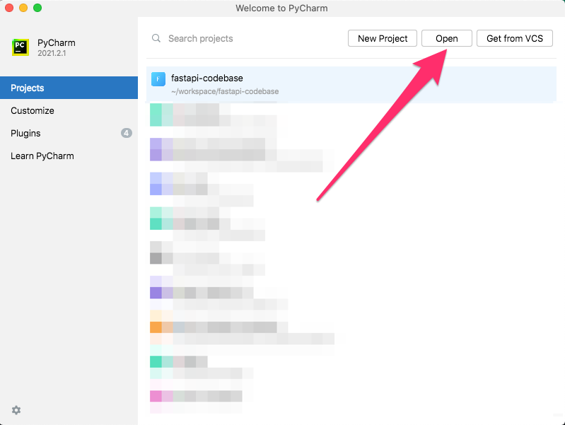
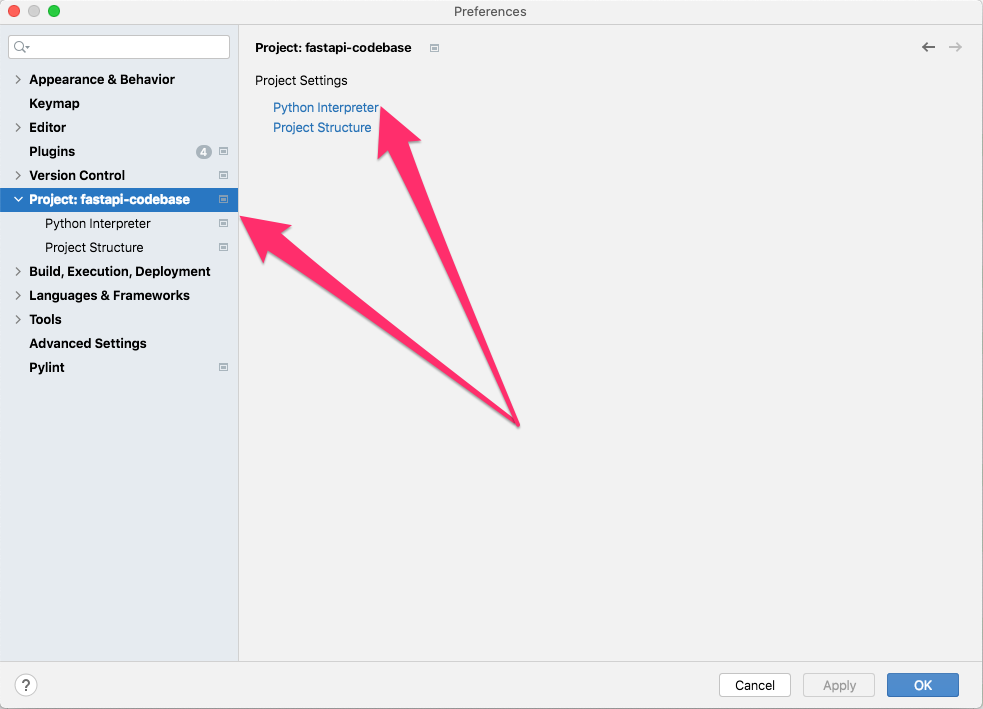
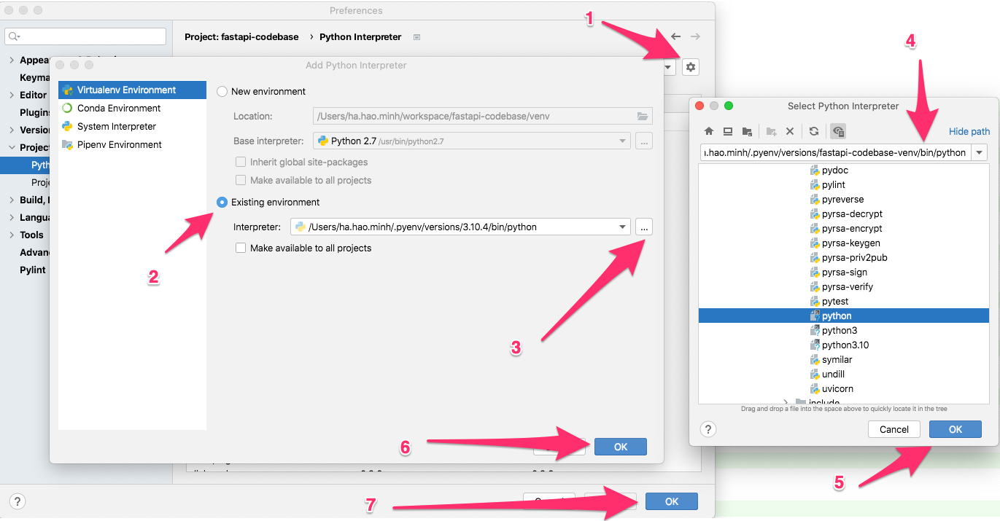
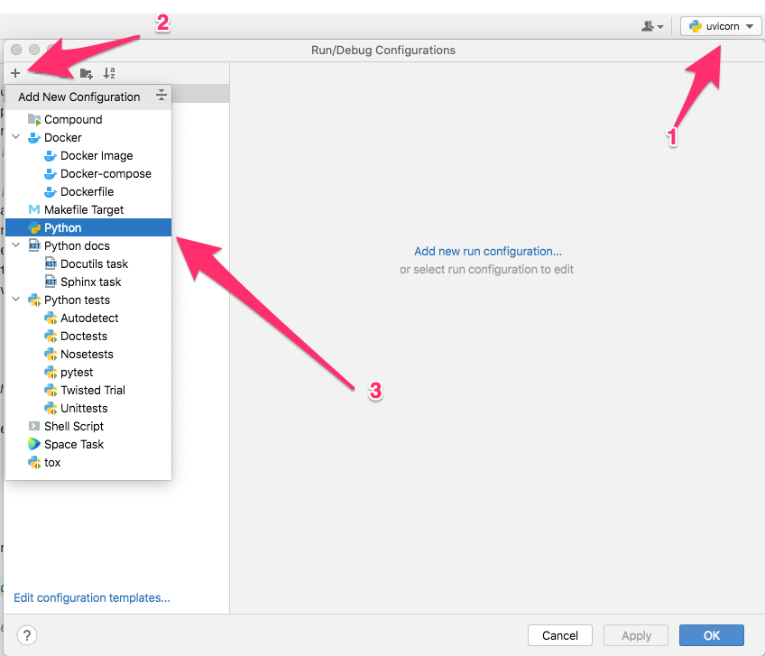
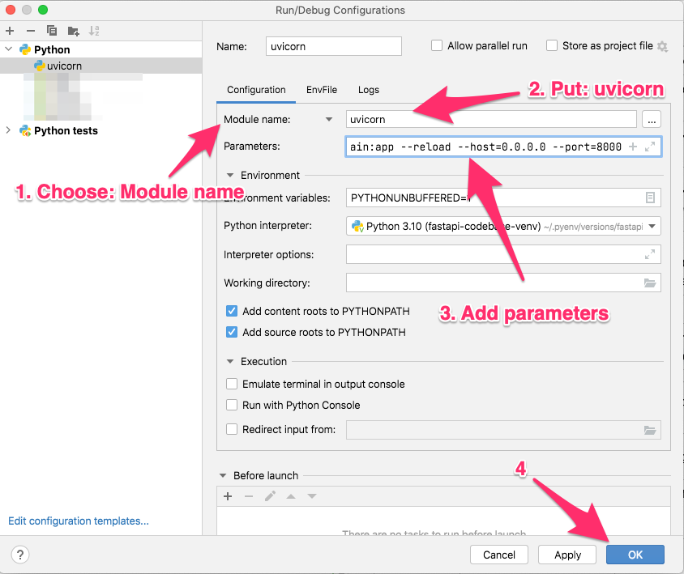
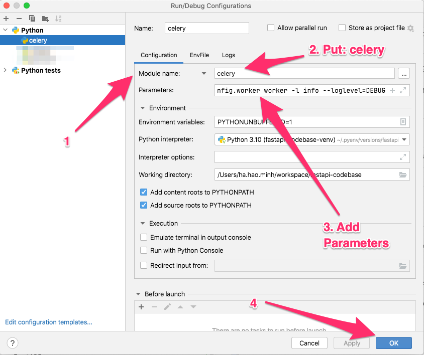
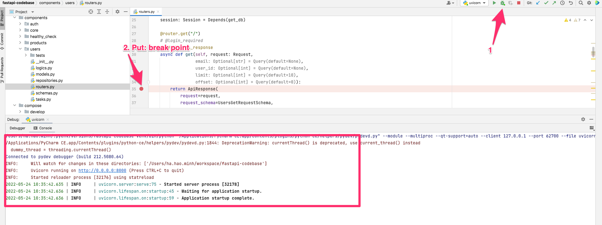

# Usage Development

In the guide, i used `develop.yml` for development environment.

## Command Table

| Command | Use within Docker | Use without Docker | Note |
|--- |--- |--- |--- |
| Build the stack | make build | pip install poetry && pip install | |
| Add new package | make run poetry add package-name | poetry add package-name | |
| Add new package dev | make run poetry add package-name --dev | poetry add package-name --dev | |
| Run the stack | make start | uvicorn main:app --host 0.0.0.0 --port 8000 --reload | optional `--reload` to enable hot-reload when the code changes |
| View logs | make logs | N/A |  |
| Stop the stack | make stop | use key combination `control + C` | |
| Make migrations | make run alembic revision -m "create table-name table" | alembic revision -m "create table-name table" | |
| Migrate database | make migrate | alembic upgrade head | |
| Check code convention | make lint | find . -type f -name "*.py" &#124; xargs pylint | |
| Run tests | make test | py.test | make sure is package dev installed |
| Run coverage | make test_coverage | coverage run -m pytest && \ coverage report -m | make sure is package dev installed |
| Custom command in container | make run `<comamnd>` | N/A | |

*Note*: I used `Makefile` to short command. You can read the `Makefile` to understand the commands details.

### Debug on Pycharm when use without Docker

In the guide, I used [pyenv](https://github.com/pyenv/pyenv) and [pyenv-virtualenv](https://github.com/pyenv/pyenv-virtualenv) plugin.

Pycharm, It's of course. I use [Pycharm Community](https://www.jetbrains.com/pycharm/download/) to debug code. PyCharm is the best IDE I've ever used.

**Before start setup debug on Pycharm, please make sure you can run the stack code without Docker.**

If you're done, please follow step:

**Step 1**: Open Pycharm and import project into Pycharm

*Pycharm > Preferences > Project: project-name*

**Step 2**: Add `Python Interpreter`

_Project: <project-name> > Python Interpreter_

*Add new > Existing environment > Select Python Interpreter Path*

**Step 3**: Configuration run server FastAPI

*Select Run/Debug Configuration > Add New Configuration > Python* 

*Choose Module name > Put: **uvicorn** > Put parameters: **main:app --reload --host=0.0.0.0 --port=8000***

**Step 4**: [**Optional**] Configuration run server Celery

*Choose Module name > Put: **celery** > Put parameters: **-A config.celery_app worker -l info -B***

**Step 5**: Debug

Run server now

Well done. :tada:

### Get help

Please contact me if:

- You can't config Pycharm on your project.
- You want to use [Visual Studio Code](https://code.visualstudio.com/) instead.
- You want's to use break points or debug code in server.
